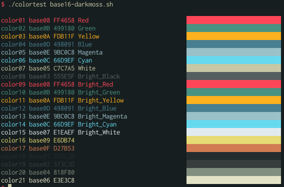

Darkmoss
========

A dark color scheme for `Base16`_.

To give it a try, use one of the builders avaiable for base16.

Example using `Python Builder`_.
--------------------------------

Install base16 python builder:

::

    pip install pybase16-builder

Create a directory to serve as working directory for base16-builder and get all official schemes and templates.

::

    mkdir base16-builder
    cd base16-builder
    pybase16 update

Add darkmoss scheme in the schemes directory.

::

    git clone https://github.com/avanzzzi/base16-darkmoss-scheme.git schemes/darkmoss

Add any additional template you may find useful, for instance, `airline`_.

::

    git clone https://github.com/jfelchner/base16-vim-airline-template.git templates/airline

Build the scheme for all templates:

::

    pybase16 build -s darkmoss

An ``output`` directory will be created with darkmoss avaiable for all base16 templates.

.. _Base16: https://github.com/chriskempson/base16
.. _Python Builder: https://github.com/InspectorMustache/base16-builder-python
.. _airline: https://github.com/jfelchner/base16-vim-airline-template
