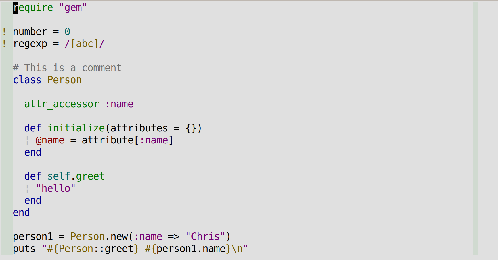

# base16-dirtysea-scheme

A color scheme for [base16](https://github.com/chriskempson/base16).

Dark themes look good and feel good on the eyes. If you have to switch back and
forth to a web browser during your normal work, though, they can end up causing
even more eye-strain, because most websites use a light theme.

This is my attempt at a low-saturation, hight-contrast theme with a grey
background. The contrast between the grey background and the white background of
most websites is less jarring. Moreover, the grey background is much less
susceptible to glare than dark backgrounds. The colors give just enough contrast
to aid comprehension without being too much of a distraction. At least thats the
idea anyway.

