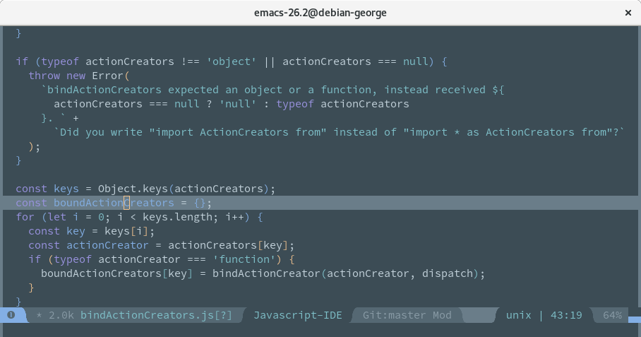

# base16-nova-scheme

This is a [base16](https://github.com/chriskempson/base16) version of the [Nova](https://trevordmiller.com/projects/nova) color scheme created originally by [Trevor D. Miller](https://trevordmiller.com/).

## Colors

## Examples

### JavaScript

### Clojure

### PHP

