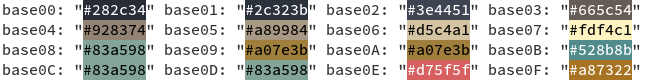
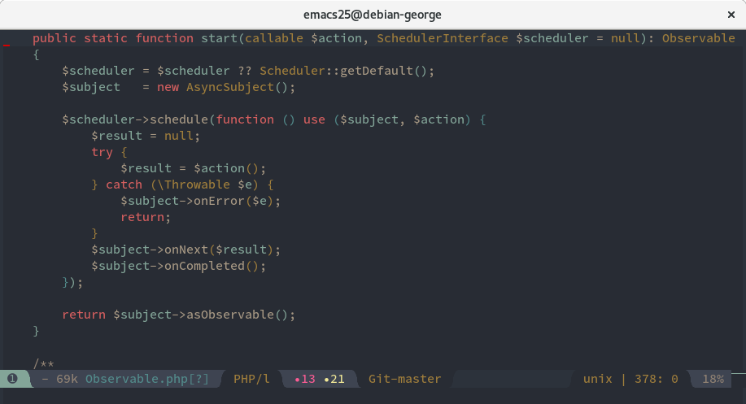
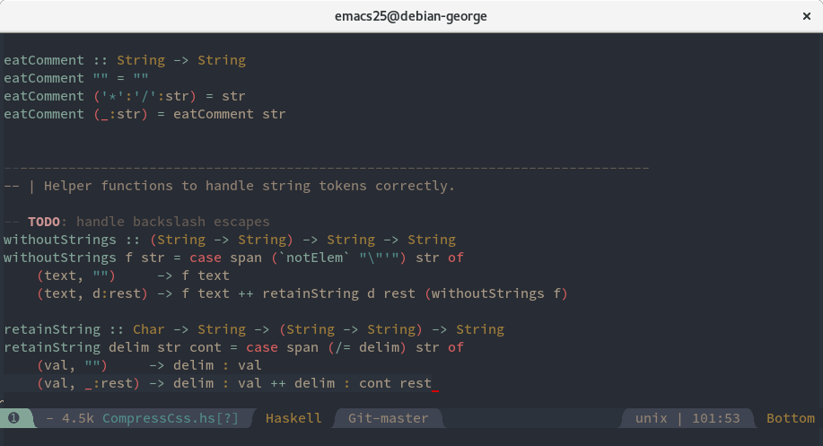
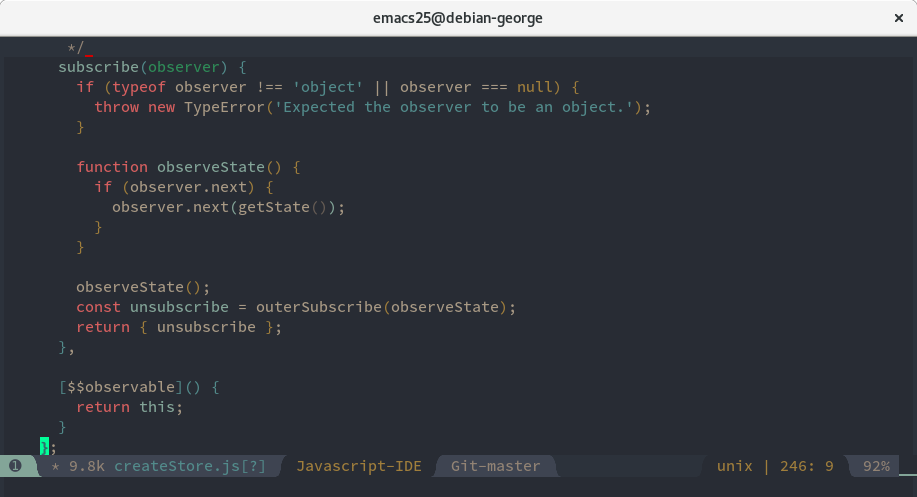

# base16-sandcastle-scheme

Sandcastle is a [base16](https://github.com/chriskempson/base16) color scheme that is a mashup of [Darktooth](https://github.com/emacsfodder/emacs-theme-darktooth), [Zerodark](https://github.com/NicolasPetton/zerodark-theme), and [base16-atelier-savanna](https://atelierbram.github.io/syntax-highlighting/atelier-schemes/savanna/).

## Sandcastle base16 colors:

## Examples

### PHP

### Haskell

### JavaScript

