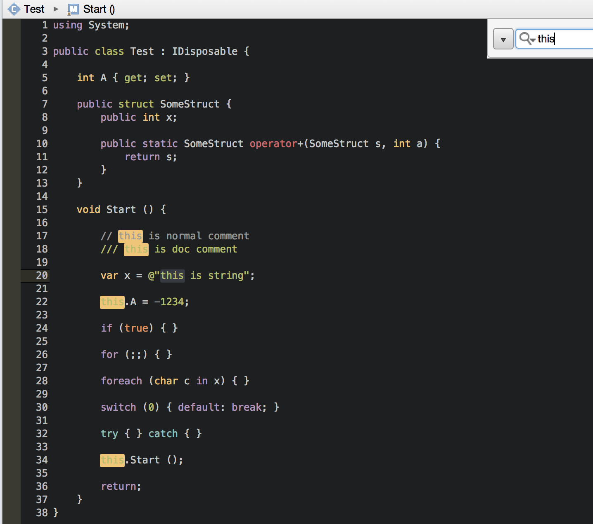

# Base16 Monodevelop
See the [Base16 repository](https://github.com/chriskempson/base16) for more information.
This theme was built with [Base16 Builder](https://github.com/chriskempson/base16-builder).

Supports [MonoDevelop](http://www.monodevelop.com/) and [VisualStudio for Mac](https://www.visualstudio.com/vs/visual-studio-mac/)




## Installation

* Open `Menu -> Tools -> Options` in MonoDevelop.
* Navigate to `Text Editor -> Syntax Highlighing`.
* Press `Add` button.
* Navigate to file in `themes/` directory.
* Press `Open`.
* Select base16 theme and then press `OK`.
* Close and reopen all your file tabs.


## Reference
* http://chriskempson.com/projects/base16/
* https://github.com/richardneililagan/base16-builder-node
* http://www.monodevelop.com/developers/articles/color-scheme-definition/

```
base00 - Default Background
base01 - Lighter Background (Used for status bars)
base02 - Selection Background
base03 - Comments, Invisibles, Line Highlighting
base04 - Dark Foreground (Used for status bars)
base05 - Default Foreground, Caret, Delimiters, Operators
base06 - Light Foreground (Not often used)
base07 - Light Background (Not often used)
base08 - Variables, XML Tags, Markup Link Text, Markup Lists, Diff Deleted
base09 - Integers, Boolean, Constants, XML Attributes, Markup Link Url
base0A - Classes, Markup Bold, Search Text Background
base0B - Strings, Inherited Class, Markup Code, Diff Inserted
base0C - Support, Regular Expressions, Escape Characters, Markup Quotes
base0D - Functions, Methods, Attribute IDs, Headings
base0E - Keywords, Storage, Selector, Markup Italic, Diff Changed
base0F - Deprecated, Opening/Closing Embedded Language Tags e.g. <?php ?>

scheme-name - obtained from the scheme file
scheme-author - obtained from the scheme file
scheme-slug - obtained from the scheme file ;; https://en.m.wikipedia.org/wiki/Semantic_URL#Slug
base00-hex to base0F-hex - obtained from the scheme file e.g "7cafc2"
base00-hex-r to base0F-hex-r - built from the hex value in the scheme file e.g "7c"
base00-hex-g to base0F-hex-g - built from the hex value in the scheme file e.g "af"
base00-hex-b to base0F-hex-b - built from the hex value in the scheme file e.g "c2"
base00-rgb-r to base0F-rgb-r - converted from the hex value in the scheme file e.g "124"
base00-rgb-g to base0F-rgb-g - converted from the hex value in the scheme file e.g "175"
base00-rgb-b to base0F-rgb-b - converted from the hex value in the scheme file e.g "194"
```
